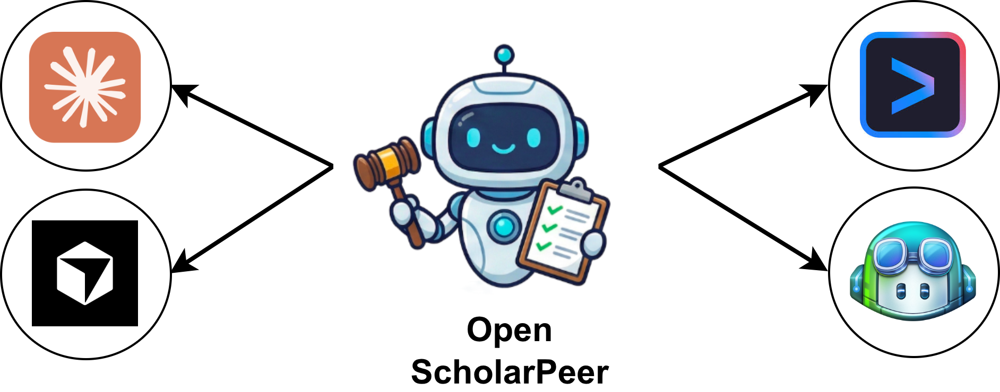
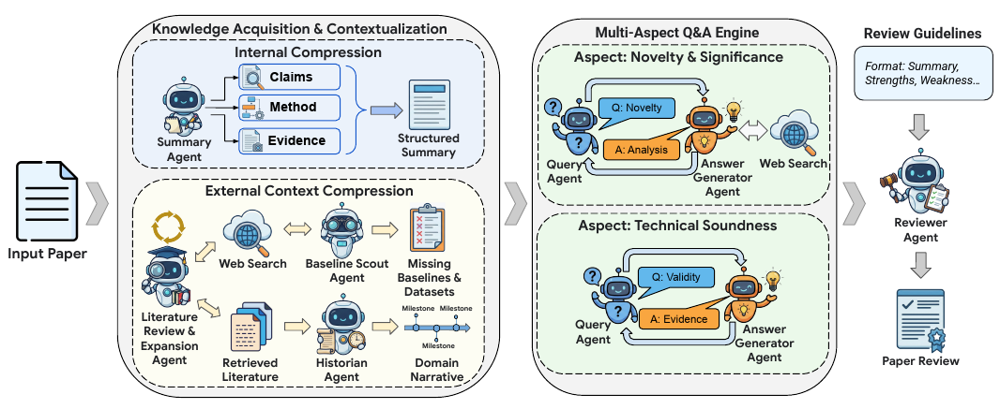

# Open ScholarPeer (OSP)

A community implementation of [**ScholarPeer**: A Context-Aware Multi-Agent Framework for Automated Peer Review](docs/paper/scholar_peer_arxiv.pdf) — runnable inside the AI coding tools you already use.

<div align="center">
  <figure>
    
  </figure>
</div>

OSP turns the paper's 7-agent pipeline into a portable set of Skills, Slash Commands, and MCP tools that install into your project directory. Use your favorite AI tool to review papers.

---

## 🚀 Quickstart

In CLI:

```bash
curl -sSL https://raw.githubusercontent.com/amirkiarafiei/open-scholar-peer/main/install.sh | bash
```

## How it works


Given an academic paper, OSP runs a 7-step protocol to produce a venue-formatted peer review:

<figure>
  
  <figcaption>ScholarPeer architecture diagram. Source: Google paper, <a href="https://arxiv.org/abs/2601.22638">https://arxiv.org/abs/2601.22638</a>.</figcaption>
</figure>

---

| Step | Persona | What it produces |
| --- | --- | --- |
| 0 | Onboarding | Detects venue, scrapes review guidelines, scaffolds the working directory |
| 1 | Summary Agent | Structured summary (claims, method, evidence) |
| 2 | Literature Review Agent | 3-round live retrieval (sub-domain anchor, method anchor, temporal expansion) |
| 3 | Historian Agent | Chronological domain narrative |
| 4 | Baseline Scout | Adversarial audit of missing baselines and datasets |
| 5 | Q&A Engine | Configurable Q&A pairs per criterion, default 2 (subagent-isolated where possible) |
| 6 | Reviewer Agent | Final consolidated review formatted to the venue's guidelines |

Every artifact is saved as auditable markdown in `.brain/raw/` and `.brain/review/`. No black box.

---

## 🛠️ Installation

From your project directory (the directory containing the paper you want to review):

```bash
# One-liner installer

curl -sSL https://raw.githubusercontent.com/amirkiarafiei/open-scholar-peer/main/install.sh | bash
```

Or clone and run locally:

```bash
git clone https://github.com/amirkiarafiei/open-scholar-peer
cd open-scholar-peer
bash install.sh   # interactive — pick your AI tool
```

The installer:
1. Copies the right adapter files into your project (`.claude/`, `.cursor/`, etc.).
2. Initializes `.brain/` (gitignored — your working state).
3. Sets up a self-contained Python venv at `.open-scholar-peer/mcp/` (gitignored — the MCP server).
4. Wires the MCP server into your AI tool's config.

Then in your AI tool:

```text
/0-osp-onboarding         ← venue + paper detection
/1-osp-summary
/2-osp-literature
/3-osp-historian
/4-osp-baseline-scout
/5-osp-qa
/6-osp-review
```

Or just run `/open-scholar-peer` at any time — it reads your session state and tells you which command comes next.

---

## Literature Databases

OSP currently connects to arXiv and Semantic Scholar for paper discovery and evidence gathering.

| Database | Support | API Key |
| --- | --- | --- |
| arXiv | ✅ | Not Required |
| Semantic Scholar | ✅ | Optional |
| PubMed | 🚧 Soon | Not Required |
| bioRxiv | 🚧 Soon | Not Required |
| medRxiv | 🚧 Soon | Not Required |
| DBLP | 🚧 Soon | Not Required |
| ACM | 🚧 Soon | Required |
| IEEE | 🚧 Soon | Required |
| WoS | 🚧 Soon | Required |
| Scopus | 🚧 Soon | Required |
| Springer | 🚧 Soon | Required |
| ScienceDirect | 🚧 Soon | Required |

The literature search layers is implemented in [mcp-server/](mcp-server/), so you can extend it with additional scholarly sources when you have valid access credentials.

### 🔑 API keys

The installer creates a `.env` file at your project root. Add your keys there:

```bash
# .env  (gitignored — never committed)
SEMANTIC_SCHOLAR_API_KEY=sk-...
```

Anonymous Semantic Scholar limits are tight. Get a free key at https://www.semanticscholar.org/product/api#api-key — the MCP server loads `.env` automatically on startup.

---

## 🔌 Supported AI tools

| Tool | Subagent isolation | MCP auto-config |
| --- | --- | --- |
| [Claude Code](https://claude.com/claude-code) | ✓ | ✓ (`.mcp.json`) |
| [Cursor](https://cursor.com) | ✓ | ✓ (`.cursor/mcp.json`) |
| [Gemini CLI](https://github.com/google-gemini/gemini-cli) | ✓ | ✓ (`.gemini/settings.json`) |
| [Copilot CLI](https://docs.github.com/en/copilot/how-tos/copilot-cli/) | ✓ | ✓ (`~/.copilot/mcp-config.json`) |
| [Codex CLI](https://github.com/openai/codex) | ✓ | via `codex mcp add` (TOML) |
| [Qwen Code](https://github.com/QwenLM/qwen-code) | ✓ | ✓ (`.qwen/settings.json`) |
| [OpenCode](https://opencode.ai) | ✓ | via `opencode mcp add` (or `opencode.json`) |
| [Junie](https://www.jetbrains.com/junie/) | ✓ | ✓ (`.junie/mcp/mcp.json`) |
| [Kiro](https://kiro.dev) | ✓ | ✓ (`.kiro/settings/mcp.json`) |
| [Kimi Code](https://moonshotai.github.io/kimi-cli/) | ✓ | ✓ (`~/.kimi/mcp.json`) |
| [Mistral Vibe](https://docs.mistral.ai/mistral-vibe/) | ✗ (self-reflection fallback) | manual snippet (TOML) |
| [OpenHands](https://docs.openhands.dev) | ✗ (self-reflection fallback) | via OpenHands UI / `config.toml` |
| [Antigravity](https://antigravity.google/) | ✗ (self-reflection fallback) | ✓ (`~/.gemini/antigravity/mcp_config.json`) |
| [Antigravity CLI](https://antigravity.google/cli/) | ✓ | ✓ (`.agents/mcp_config.json`) |

See [`docs/KNOWN_LIMITATIONS.md`](docs/KNOWN_LIMITATIONS.md) for self-reflection caveats and per-tool MCP wiring details.

---

## Architecture at a glance

```
extensions/
├── _shared/           ← Single source of truth (humans edit here)
│   ├── commands/      ← 8 slash commands
│   ├── skills/        ← 8 personas (orchestrator + 7 paper agents)
│   ├── rules/         ← always-on instructions
│   └── defaults/      ← templates that enforce structure (k=3 rounds, N=qa_pairs_per_criterion)
└── .{claude,cursor,gemini,agent,agents,github,junie,kiro,
       codex,kimi,qwen,vibe,opencode,openhands}/   ← Auto-generated per-tool adapters (14 tools)

mcp-server/
├── osp_mcp.py         ← Consolidated FastMCP server
└── providers/         ← arxiv, semantic_scholar, google_scholar (extensible)

scripts/
├── sync_adapters.py   ← Regenerates per-tool adapters from _shared/
├── install_*.sh       ← Per-tool installers
├── init_mcp.sh        ← Sets up .open-scholar-peer/mcp/ with venv
└── test_*.{py,sh}     ← Parity + install smoke tests

.brain/                ← Per-project state (gitignored)
└── raw/, review/, input/, session.json

.open-scholar-peer/mcp/     ← Per-project MCP runtime (gitignored)
```

---

## Documentation

- **[`docs/PHASES.md`](docs/PHASES.md)** — Build plan and execution checklist.
- **[`docs/IDEA.md`](docs/IDEA.md)** — Design philosophy.
- **[`docs/BRAIN_LAYOUT.md`](docs/BRAIN_LAYOUT.md)** — `.brain/` filesystem contract.
- **[`docs/ARTIFACT_CONTRACTS.md`](docs/ARTIFACT_CONTRACTS.md)** — Per-step I/O contract.
- **[`docs/KNOWN_LIMITATIONS.md`](docs/KNOWN_LIMITATIONS.md)** — What to expect, what won't work, workarounds.
- **[`docs/TROUBLESHOOTING.md`](docs/TROUBLESHOOTING.md)** — Common issues, by symptom.
- **[`docs/CONTRIBUTING.md`](docs/CONTRIBUTING.md)** — How to extend OSP (commands, skills, MCP providers).
- **[`docs/paper/SUMMARY.md`](docs/paper/SUMMARY.md)** — Paper essence (architecture and protocol).

---

## License

MIT.

## Citation

If you use OSP in research, please cite the upstream ScholarPeer paper. The implementation here is community-built and is not affiliated with the paper's authors or Google.

```bibtex
@article{goyal2026scholarpeer,
  title={ScholarPeer: A Context-Aware Multi-Agent Framework for Automated Peer Review},
  author={Goyal, Palash and Parmar, Mihir and Song, Yiwen and Palangi, Hamid and Pfister, Tomas and Yoon, Jinsung},
  journal={arXiv preprint arXiv:2601.22638},
  year={2026},
  doi={10.48550/arXiv.2601.22638},
  url={https://arxiv.org/abs/2601.22638}
}
```

---

## Community

- [Contributing](CONTRIBUTING.md)
- [Code of Conduct](CODE_OF_CONDUCT.md)
- [License](LICENSE)

