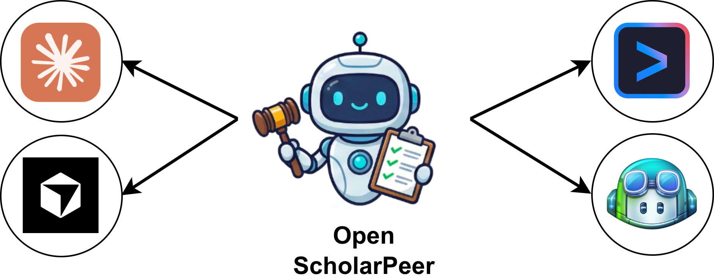
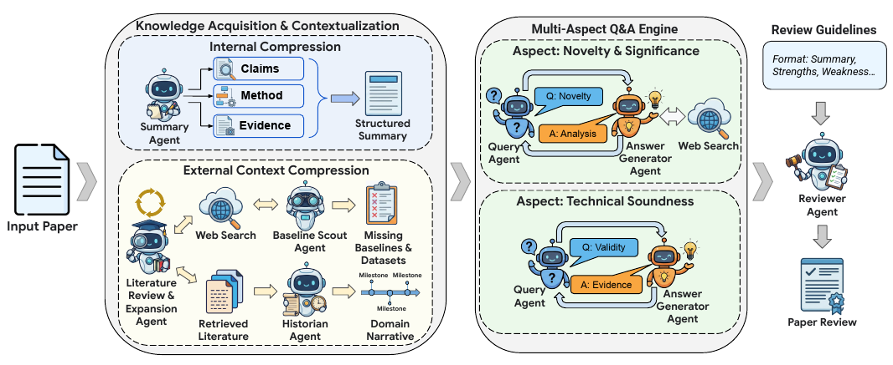

# Open ScholarPeer (OSP)

<p align="center">
  <a href="https://deepwiki.com/amirkiarafiei/open-scholar-peer"></a>
</p>

A community implementation of [**ScholarPeer**: A Context-Aware Multi-Agent Framework for Automated Peer Review](https://arxiv.org/abs/2601.22638) — runnable inside the AI coding tools you already use.

<div align="center">
  <figure>
    
  </figure>
</div>

OSP turns the paper's 7-agent pipeline into a portable set of Skills, Slash Commands, and MCP tools that install into your project directory. Use your favorite AI tool to review papers.

---

## 🚀 Quickstart

**1. In your terminal**, from the directory holding the paper you want to review:

```bash
curl -sSL https://raw.githubusercontent.com/amirkiarafiei/open-scholar-peer/main/install.sh | bash
```

**2. Open your code agent** in that directory, and in its interactive chat run:

```text
/open-scholar-peer
```

## How it works


Given an academic paper, OSP runs a 7-step protocol to produce a venue-formatted peer review:

<figure>
  
  <figcaption>ScholarPeer architecture diagram. Source: Google paper, <a href="https://arxiv.org/abs/2601.22638">https://arxiv.org/abs/2601.22638</a>.</figcaption>
</figure>

---

First, you can invoke `/open-scholar-peer` and it guides you towards the steps.

| Step | Persona | Command | What it produces |
| --- | --- | --- | --- |
| 0 | Onboarding | `/0-osp-onboarding` | Detects venue, scrapes review guidelines, scaffolds the working directory |
| 1 | Summary Agent | `/1-osp-summary` | Structured summary (claims, method, evidence) |
| 2 | Literature Review Agent | `/2-osp-literature` | 3-round live retrieval (sub-domain anchor, method anchor, temporal expansion) |
| 3 | Historian Agent | `/3-osp-historian` | Chronological domain narrative |
| 4 | Baseline Scout | `/4-osp-baseline-scout` | Adversarial audit of missing baselines and datasets |
| 5 | Q&A Engine | `/5-osp-qa` | Configurable Q&A pairs per criterion, default 2 (subagent-isolated where possible) |
| 6 | Reviewer Agent | `/6-osp-review` | Final consolidated review formatted to the venue's guidelines |

### How to View Artifcats

Every artifact is saved as auditable markdown in `.brain/raw/` and `.brain/review/`. No black box.

---

## 🛠️ Installation

### Option 1: Interactive Installer

From the directory containing the paper you want to review:

```bash
curl -sSL https://raw.githubusercontent.com/amirkiarafiei/open-scholar-peer/main/install.sh | bash
```

### Option 2: Clone and Run Locally

```bash
git clone https://github.com/amirkiarafiei/open-scholar-peer
bash open-scholar-peer/install.sh --dir /path/to/the/paper/you/are/reviewing
```

Without `--dir` the installer offers the directory you are standing in — which, after `cd`, is the
clone rather than your paper.

Skip the prompts with `--dir <path>`, `--tool claude,cursor` and `--sources arxiv,openalex`. `bash install.sh --help` lists every option.

### What is installed on your machine?

Everything lands in the directory you ran the installer from. Four things:

| What | Where | Why |
| --- | --- | --- |
| **`.brain/`** | your project | To manage session state and write intermediary results and artifacts. Everything is saved as Markdown/JSON |
| **Agent config** — Slash Commands, Skills, MCP config | your tool's own directory (`.claude/`, `.cursor/`, `.gemini/`, …), plus a root file for some tools: `.mcp.json`, `AGENTS.md` or `CLAUDE.md` | To teach the review protocol to your agent and prepare the environment it |
| **`.open-scholar-peer/mcp/`** and `.venv` | your project | The paper-search tools, in Python. The virtualenv keeps their dependencies out of your system Python. The same tools ship as a command-line program too, used as a fallback when MCP is unavailable |
| **`.env`** | your project | Your optional API keys for paper search |

Installer adds `.brain/`, `.open-scholar-peer/` and `.env` to
your `.gitignore`, so a manuscript under embargo is never committed by accident. Nothing is written
outside this directory except the MCP config that a few agents insist on keeping in your home folder.
Nothing leaves the machine except the searches you ask for.

Your agent reaches the search tools over MCP by default. If MCP is not available on your tool — or
stops answering mid-session — it falls back to the same tools as a command-line program (CLI tools), and records
which one it used in `.brain/session.json`. You do not have to configure anything for that.

To remove it all: delete `.brain/`, `.open-scholar-peer/` and `.env`, plus the agent's MCP config. 

---

## Usage

Open your code agent in that directory, and in its interactive chat run the commands one-by-one:

```text
/open-scholar-peer        ← tells you which step comes next
/0-osp-onboarding         ← venue + paper detection
/1-osp-summary
/2-osp-literature
/3-osp-historian
/4-osp-baseline-scout
/5-osp-qa
/6-osp-review
```

Run `/open-scholar-peer` at any point — it reads your session state and tells you where you are.

**The output is a draft for you to edit, not a review to submit.** Every claim traces to a file in
`.brain/` so you can check it. You are the reviewer of record.

---

## Literature Databases for Paper Search

Supports six open databases and **None needs a paid subscription, and none needs an API Key to work**. An API Key is optional and increases the rate limits: 

| Database | What it covers | Free | Rate limit |
| --- | --- | --- | --- |
| **arXiv** | Preprints in CS, physics and maths | Yes | 1 request / 3 s, one connection at a time |
| **Semantic Scholar** | Broad Coverage. Includes citation graphs and recommendations | Yes (Optional API Key) | Keyless: Unpredictable. With a key: 1 request / s of your own |
| **Google Scholar** | Broadest coverage (Best-effot Scraping) | Yes | None published. Its bot detection may block you. |
| **Europe PMC** | Biomedical and life sciences | Yes | 10 requests / s, 500 / min, per IP address |
| **Zenodo** | Code, datasets and software releases | Yes (Optional API Key) | Search API 30 requests / min (60 / min general, 100 / min with a token) |
| **OpenAlex** | 327 million works, with retraction flags | Free and Paid Tiers | Daily budget without API Key: $0.10/day ≈ 100 calls**, **$1/day with an optional free API Key ≈ 1,000 calls. Hard ceiling 100 requests / s |

**Deliberately not included:** ACM DL, IEEE Xplore, Web of Science, Scopus, Springer and ScienceDirect all
need a subscription or a paid key, which is the one thing this project will not require of you.

**Extending Databases:** The search layer lives in [mcp-server/](mcp-server/), and
[docs/CONTRIBUTING.md](docs/CONTRIBUTING.md) has the info for adding and extending MCP Servers for Paper Search.

### 🔑 API keys

You can input your keys during installations, or add them manually in `.env`:

```bash
# .env  (gitignored — never committed)
SEMANTIC_SCHOLAR_API_KEY=...       # a rate limit of your own
OPENALEX_API_KEY=...               # 10× the keyless daily budget
ZENODO_API_TOKEN=...               # 100 requests/min instead of 60
GOOGLE_SCHOLAR_PROXY_URL=...       # the only thing that helps once Google blocks your address

# which databases the agent may search; remove the line for all of them
OSP_SOURCES=arxiv,semantic_scholar,google_scholar,europepmc,zenodo,openalex
```

The MCP server loads `.env` automatically on startup.

---

## 🔌 Supported AI tools

| Tool | MCP auto-config |
| --- | --- |
| [Claude Code](https://claude.com/claude-code) | ✓ (`.mcp.json`) |
| [Cursor](https://cursor.com) | ✓ (`.cursor/mcp.json`) |
| [Gemini CLI](https://github.com/google-gemini/gemini-cli) | ✓ (`.gemini/settings.json`) |
| [Copilot CLI](https://docs.github.com/en/copilot/how-tos/copilot-cli/) | ✓ (`~/.copilot/mcp-config.json`) |
| [Codex CLI](https://github.com/openai/codex) | ✓ (`~/.codex/config.toml`) |
| [Qwen Code](https://github.com/QwenLM/qwen-code) | ✓ (`.qwen/settings.json`) |
| [OpenCode](https://opencode.ai) | ✓ (`.opencode/opencode.json`) |
| [Junie](https://www.jetbrains.com/junie/) | ✓ (`.junie/mcp/mcp.json`) |
| [Kiro](https://kiro.dev) | ✓ (`.kiro/settings/mcp.json`) |
| [Kimi Code](https://moonshotai.github.io/kimi-cli/) | ✓ (`~/.kimi/mcp.json`) |
| [Mistral Vibe](https://docs.mistral.ai/mistral-vibe/) | ✓ (`.vibe/config.toml`) |
| [OpenHands](https://docs.openhands.dev) | ✓ CLI (`~/.openhands/mcp.json`); web UI needs a paste |
| [Antigravity](https://antigravity.google/) | ✓ (`~/.gemini/antigravity/` + `~/.gemini/config/`) |
| [Antigravity CLI](https://antigravity.google/cli/) | ✓ (`.agents/mcp_config.json` + `~/.gemini/antigravity-cli/`) |
| [Pi](https://pi.dev) | n/a — Pi ships no MCP client; searches run through the bundled CLI, which every install carries |
| [Oh My Pi](https://omp.sh) | ✓ (`.omp/mcp.json`) |
| [Grok Build](https://docs.x.ai/build/overview) | ✓ (`.grok/config.toml`) |
| [Hermes](https://hermes-agent.nousresearch.com/docs/) | ✓ (`~/.hermes/config.yaml`) |
| [Cline](https://docs.cline.bot) | ✓ (`~/.cline/data/settings/cline_mcp_settings.json`, per machine) |
| [Kilo Code](https://kilo.ai/docs) | ✓ (`.kilo/kilo.json`) |
| [OpenClaw](https://docs.openclaw.ai) | ✓ (global, via `openclaw mcp add`) |

Two notes, because they change what you get. The Q&A step (`/5-osp-qa`) normally runs the Answer
Generator as a separate subagent with its own context. On **Mistral Vibe**, **OpenHands**, **Pi** and
**Cline** it cannot, so both roles run in one context window with turn markers — a documented weaker
substitute, described in [`docs/KNOWN_LIMITATIONS.md`](docs/KNOWN_LIMITATIONS.md). And **OpenClaw** is
one assistant per machine rather than a per-project tool, so after installing you tell it which folder
to work in; its installer prints how.

---

## Documentation

- **[`docs/BRAIN_LAYOUT.md`](docs/BRAIN_LAYOUT.md)** — `.brain/` filesystem contract.
- **[`docs/ARTIFACT_CONTRACTS.md`](docs/ARTIFACT_CONTRACTS.md)** — Per-step I/O contract.
- **[`docs/KNOWN_LIMITATIONS.md`](docs/KNOWN_LIMITATIONS.md)** — What to expect, what won't work, workarounds.
- **[`docs/TROUBLESHOOTING.md`](docs/TROUBLESHOOTING.md)** — Common issues, by symptom.
- **[`docs/CONTRIBUTING.md`](docs/CONTRIBUTING.md)** — How to extend OSP (commands, skills, MCP providers).
- **[`docs/paper/SUMMARY.md`](docs/paper/SUMMARY.md)** — Paper essence (architecture and protocol).

### Why it is the way it is

`kia-context/` is the project's own memory — why decisions were made, what was rejected, and what must
stay true. Start at [`kia-context/INDEX.md`](kia-context/INDEX.md).

- **[`kia-context/specs/MANIFESTO.md`](kia-context/specs/MANIFESTO.md)** — The product boundary and the rules that do not move.
- **[`kia-context/specs/ARCHITECTURE.md`](kia-context/specs/ARCHITECTURE.md)** — How the protocol, the state machine and the 21-tool sync pipeline actually work.
- **[`kia-context/logs/BRAINSTORM.md`](kia-context/logs/BRAINSTORM.md)** — Decisions and the alternatives they beat.
- **[`kia-context/logs/PROGRESS.md`](kia-context/logs/PROGRESS.md)** — Milestones M1–M13, and the loop the project runs on.
- **[`kia-context/logs/PROGRESS_2.md`](kia-context/logs/PROGRESS_2.md)** — M14 onward, and what is being built now.
- **[`kia-context/genesis/`](kia-context/genesis/)** — Why the project exists, and the original design document.

---

## License

MIT.

## Citation

If you use OSP in research, please cite the upstream ScholarPeer paper. The implementation here is community-built and is not affiliated with the paper's authors or Google.

```bibtex
@article{goyal2026scholarpeer,
  title={ScholarPeer: A Context-Aware Multi-Agent Framework for Automated Peer Review},
  author={Goyal, Palash and Parmar, Mihir and Song, Yiwen and Palangi, Hamid and Pfister, Tomas and Yoon, Jinsung},
  journal={arXiv preprint arXiv:2601.22638},
  year={2026},
  doi={10.48550/arXiv.2601.22638},
  url={https://arxiv.org/abs/2601.22638}
}
```

---

## Community

- [Contributing](CONTRIBUTING.md)
- [Code of Conduct](CODE_OF_CONDUCT.md)
- [License](LICENSE)

